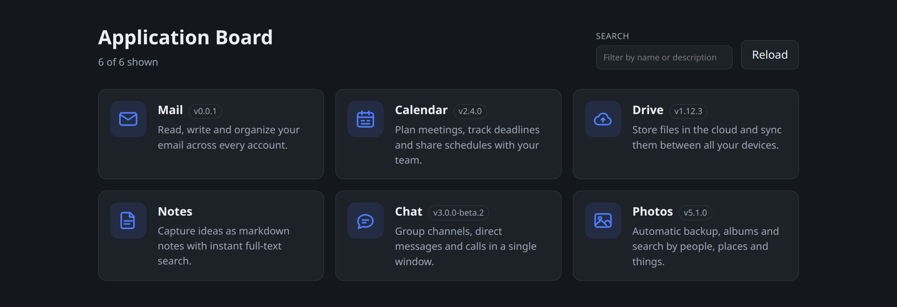

# Application Board

A React + TypeScript page that lists applications (icon, title, optional
version, description), backed by a small dependency-free Node test server that
can serve different sets of applications as JSON.



The main page, serving the `default` set of the test server. Cards carrying a
`main` link open the application itself; the version badge is shown only for
entries that declare one — `Notes` above has neither.

## Getting started

```bash
npm install
npm run dev
```

Open http://localhost:3000 — the page, its assets and the API are all served
from that one port (set `PORT` to change it). In dev, `server/index.js` runs
Vite in middleware mode, so hot reload shares the same port too; there is no
second server and no proxying.

| Script | What it does |
| --- | --- |
| `npm run dev` | Single-port dev server (page + API + HMR) on `:3000` |
| `npm run build` | Typecheck + production build into `dist/` (flat: `index.html` + hashed JS/CSS) |
| `npm run build:dev` | Same, in development mode — also builds `admin.html` into `dist/` |
| `npm start` | Same single port, serving the built `dist/` instead of Vite |
| `npm run typecheck` | `tsc --noEmit` |

## Base URL

Any script takes `--base-url=<path>` to serve the whole app under a path
prefix:

```bash
npm run dev   --base-url=/apps    # http://localhost:3000/apps/
npm run build --base-url=/123     # build the page for /123/
npm start     --base-url=/123     # serve that build at /123/
```

npm passes the flag through as `npm_config_base_url`; `BASE_URL=/apps` in the
environment or a literal `--base-url=/apps` argv flag work the same, for use
without npm. `server/base-url.js` normalizes it (`apps`, `/apps/`, `//apps//`
all become `/apps`) and is shared by the server and `vite.config.ts`, so both
agree.

The prefix applies to everything: the page and its assets, client routes
(`/apps/apps/mail`), API calls (`/apps/api/applications`), the icons, and the
icon links inside the JSON (`"icon": "/apps/icons/mail.svg"`). Client code
never hard-codes it — `src/base.ts` reads Vite's `import.meta.env.BASE_URL`,
`api.ts` prefixes every request and `router.ts` prefixes every route. Requests
outside the prefix 404, and `/` redirects to the base.

The build bakes the prefix into `index.html` and the bundle, so a build made
with `--base-url=/123` must be served with the same value.

## Build manifest

Every build writes `dist/manifest.json` describing the artifact — its base URL,
its entry pages and every shipped file with the URL it is served from:

```json
{
  "name": "appboard-wla",
  "base": "/apps",
  "entries": [
    {
      "title": "Application Board",
      "version": "1.0.0",
      "description": "Application board page listing the applications a server publishes",
      "main": "/apps",
      "icons": [
        { "url": "/apps/favicon.svg", "colorScheme": "light" },
        { "url": "/apps/favicon.svg", "colorScheme": "dark" }
      ]
    }
  ],
  "files": [
    { "url": "/apps/favicon.svg", "file": "favicon.svg" },
    { "url": "/apps/index-C_3nu1oS.js", "file": "index-C_3nu1oS.js", "type": "text/javascript" },
    { "url": "/apps", "file": "index.html", "type": "text/html" }
  ]
}
```

`index.html` is listed at the base URL itself, matching how the server serves
it. `files` is generated from the actual build output, so a `build:dev`
artifact also lists `admin.html` and its chunk. `base` follows `--base-url`.

`name` is the package name, and an entry's `version` and `description` are the
package version and description — all read from [package.json](package.json) at
build time, so renaming, releasing or redescribing the package carries through
to the manifest. An entry may override `version` and `description` in the
`manifest({...})` options; an entry left with neither is written without the
field rather than with an empty one. The entry titles, icons and screenshots
come from those same options in [vite.config.ts](vite.config.ts); the plugin is
`tools/manifest-plugin.ts`. Icons and screenshots reference files by their name
in the build output (`favicon.svg` lives in `public/`, which Vite copies into
`dist/`), and `screenshots` is omitted while none are configured.

The manifest is a build artifact: `GET /manifest.json` serves it from `dist/`
and 404s when there is no build, rather than falling back to the page.

## Test API

`server/index.js` — node builtins only in production; in dev it additionally
imports Vite as middleware. Data lives in `server/data.js`.

```
GET /api/sets
  -> { "sets": ["default", "developer", "media", "empty"] }

GET /api/applications?set=<name>&delay=<ms>&fail=1
  -> [ { ... }, ... ]               # a bare array of entries

GET /api/applications/<slug>
  -> { "application": { ... } }     # looked up across all sets, 404 if unknown

GET /api/admin/preset               # development only, 404 in production
  -> { "activePreset": "default", "presets": [...] }
PUT /api/admin/preset  { "preset": "developer" }
  -> { "activePreset": "developer", "presets": [...] }
```

- `set` — `default`, `developer`, `media`, `empty`, or `random` to pick a
  random non-empty set on each request. An unknown name returns 404. Omit it
  and the server serves the **active preset** (see the admin page below).
- `delay` — milliseconds to wait before responding (max 10000), to see the
  loading state. Reads only; writes are never delayed.
- `fail=1` — respond with 500, to see the error state.

Entry shape:

```json
{
  "title": "Mail",
  "version": "0.0.1",
  "description": "Read, write and organize your email across every account.",
  "icon": "/icons/mail.svg",
  "main": "/launch/mail"
}
```

`main` is where choosing the application takes the user — the application's own
entry point. A card that has one is an ordinary link to it and leaves the board
when clicked; a card without one opens the built-in detail page client-side
instead, as before. Root-relative values are prefixed with the base URL like
`icon` is; a value pointing at another origin is passed through untouched.

In this test server the mock entries point `main` at `/launch/<slug>`, a
stand-in page served by `server/index.js` so the link lands somewhere instead of
falling through to the board itself. A real board points `main` at each
application's real URL and serves nothing itself.

`version` is optional. When an entry carries one it is shown as a badge next to
the title in the list and as a `Version <x>` line on the detail page; entries
without one render no version label at all.

Entries carry no id, so they are addressed by the slug of their title
(`Code Editor` → `code-editor`) — that is what `/apps/<slug>` and
`/api/applications/<slug>` use. `server/data.js` still keeps an internal `id`
per entry, which the detail lookup accepts too, but it is stripped from every
response. `slugify` exists on both sides (`server/data.js`, `src/slug.ts`).

`icon` is a root-relative link to an icon image — no domain, no external
requests. The SVGs live in `server/public/icons/` and are served straight from
disk by the server in both dev and production, so they are never bundled and
never copied into `dist/` (which only holds the page itself). A missing path
under `/icons/` returns 404 rather than the HTML page.

`AppIcon` renders the link as an `` and falls back to the first letter of
the title if the image fails to load.

To add a set, add a key to `applicationSets` in `server/data.js` — it shows up
in the page's set dropdown automatically.

## Pages

| Route | Page |
| --- | --- |
| `/` | list of applications |
| `/apps/:slug` | detail page for one application |
| `/admin.html` | **dev builds only** — pick the preset the list is served |

### Admin page (development only)

http://localhost:3000/admin.html lists the presets (`default`, `developer`,
`media`, `empty`, `random`) and marks the active one; clicking one makes it the
preset every `/api/applications` request without an explicit `?set=` returns.
Reload the list page to see the change. The active preset lives in the server's
memory, so it resets on restart.

The main page has no set selector because choosing a preset is a testing
affordance, not part of the shipped page.

**Where the admin page exists**

| | admin.html | admin API |
| --- | --- | --- |
| `npm run dev` | served by Vite | enabled |
| `npm run build:dev` + `npm start` | built into `dist/` | enabled |
| `npm run build` + `npm start` | not built — 404 | 404 |

`admin.html` is an input of the development build only, so a production build
cannot contain it. The server enables `/api/admin/preset` whenever the admin
page is reachable — always in dev, and in production when `dist/admin.html`
exists (i.e. the artifact came from `build:dev`) — so a dev build stays fully
working when served from `dist/`, while a production build has neither the page
nor the API. The startup log prints which of the two it is.

Each card is a real `<a href="/apps/:slug">`, so the whole card shows the hand
cursor and ctrl/cmd-click opens it in a new tab. Plain left clicks are handled
client-side by the small router in `src/router.ts` (History API + `popstate`,
no routing dependency). Deep links such as `/apps/mail` work in both modes:
the server falls back to `index.html` for any non-`/api/` path.

## Layout

```
index.html        main page entry
admin.html        admin entry, built by `build:dev` only
docs/
  screenshot.png  the main page, shown at the top of this file
public/
  favicon.svg     page favicon, copied into dist/ by Vite
tools/
  manifest-plugin.ts  writes dist/manifest.json
server/
  index.js        single-port server: API, server/public assets,
                  Vite middleware (dev), static dist/ + SPA fallback (prod)
  base-url.js     --base-url parsing, shared with vite.config.ts
  data.js         mock application sets
  public/
    icons/        icon images referenced by the API responses
src/
  main.tsx              entry point for index.html
  admin.tsx             entry point for admin.html
  App.tsx               route switch: list vs. application page
  base.ts               base URL prefix, from import.meta.env.BASE_URL
  slug.ts               title -> slug, mirrors server/data.js
  router.ts             History API routing helpers (base-aware)
  api.ts                typed fetch helpers
  types.ts              Application / response types
  styles.css
  components/
    ApplicationsPage.tsx  list page: search, loading/error states
    ApplicationPage.tsx   detail page for one application
    AdminPage.tsx         dev-only preset switcher
    AppList.tsx           grid + empty state
    AppCard.tsx           single application card (link to its page)
    AppIcon.tsx           icon image, with initial-letter fallback
```
